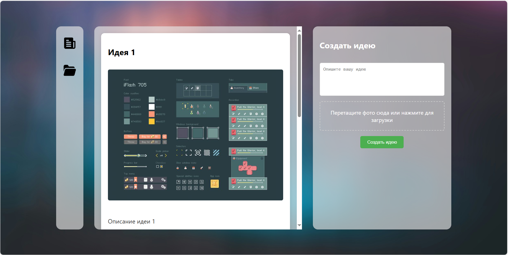

# Ideaa - сайт по продвижению идей молодежи

## Какие проблемы решает
- **Организация идей**: Платформа предоставляет пользователям возможность не только загружать свои идеи, но и делиться ими с другими, получая обратную связь в виде лайков/дизлайков и комментариев.
- **Командная работа**: Проект позволяет авторам идей приглашать в свои команды других пользователей, которые заинтересованы в идее, и совместно дорабатывать её.
- **Управление проектами**: В дополнение к генерации идей пользователи могут использовать функционал проектов с канбан-доской для отслеживания выполнения задач, что улучшает организацию рабочего процесса.

## Целевая аудитория
- **Креативные команды**: Стартапы и команды разработчиков, работающие над новыми проектами, которым нужно организовать совместную работу.
- **Менеджеры проектов**: Люди, ответственные за управление проектами и координацию командной работы.
- **Идеологи**: Люди, генерирующие идеи и нуждающиеся в обратной связи для их развития.
- **Дизайнеры и разработчики**: Пользователи, которые могут быть вовлечены в работу над проектами через платформу.

## Основные функции
- Регистрация и авторизация: Пользователи могут зарегистрироваться на платформе и входить в свои аккаунты.
- CRUD операции для идей: Возможность *создавать, читать, обновлять и удалять идеи*.
- **Лента идей**: Просмотр идей других пользователей с возможностью оценивания (*лайк/дизлайк*) и оставления комментариев.
- Управление командой: Авторы могут приглашать пользователей, которые оценили идею, в свою команду, предоставляя им права на редактирование.
- Проекты с канбан-доской: Каждый проект, основанный на идее, позволяет управлять задачами с помощью канбан-доски.
- Роли и права пользователей: Управление правами доступа для каждого участника команды на основе их роли в проекте.
- Добавление пользователей по ID: Возможность добавлять пользователей в проекты напрямую через ID без необходимости через ленту идей.

## Принцип работы
1. Пользователь регистрируется на платформе, авторизуется.
2. Создаёт идею, добавляя текст и изображение.
3. Идея появляется в ленте, где другие пользователи могут её оценивать (лайки/дизлайки) и оставлять комментарии.
4. Если пользователь лайкнул идею, автор может пригласить его в команду.
5. Участники команды получают роли и права, в зависимости от которых они могут редактировать идею или управлять проектом.
6. Для каждой идеи можно создать проект с канбан-доской, где команда может управлять задачами и отслеживать прогресс.
7. Пользователи могут также добавлять других участников по их ID, минуя процесс взаимодействия через ленту.

## Преимущества
- **Обратная связь**: Платформа позволяет пользователям легко взаимодействовать с идеями и обмениваться отзывами.
- **Легкое продвижение**: С помощью *ленты идей* о вашем проекте сможет узнать *любой* пользователь нашего сервиса и тут же подать заявку на помощь проекту.
- Доступность для IT-компаний: Компания может разместить свой проект и на безвозмездной основе получить помощь от пользователей сервиса.
- Удобная организация проектов: Удобное управление процессом разработки идеи до её воплощения в виде проекта с задачами.
- Удобный интерфейс: Легкий интерфейс для работы с идеями и задачами с возможностью просмотра, редактирования и взаимодействия с командой.

## Список задач для реализации

| Участник                | Роль                                     | Задачи                                                                                                                                                 |     |
| ----------------------- | ---------------------------------------- | ------------------------------------------------------------------------------------------------------------------------------------------------------ | --- |
| Минаев Даниил           | UI/UX дизайнер / Frontend разработчик    | - Проектирование интерфейсов в Figma. - Реализация интерфейса фронтенда для регистрации, авторизации и ленты идей. - Верстка канбан-доски.       |     |
| **Валекжанин Владимир** | Frontend разработчик                     | - Реализация CRUD функционала для идей.  - Интеграция API для проектов и команд - Взаимодействие с бекендом для лайков/дизлайков и комментариев. |     |
| Омарова Диана           | Визуальный дизайнер                      | - Разработка визуального стиля сайта. - Создание дизайна иконок и иллюстраций. - Разработка гайдлайнов по стилю и брендингу.                     |     |
| Болвачев Дмитрий        | Бекенд разработчик                       | - Разработка REST API для пользователей. - Реализация API для CRUD операций с идеями. - Работа с медиафайлами. - API для канбан-доски.        |     |
| Гостева Дарья           | Аналитик                                 | - Сбор и анализ требований к платформе. - Исследование конкурентов. - Составление технического задания.                                          |     |
| Новашинский Яков        | DevOps инженер / Бекенд разработчик      | - Настройка серверной инфраструктуры. - Настройка CI/CD для автоматизации. - Обеспечение безопасности и мониторинга системы.                     |     |
| Самарин Егор            | Инженер по тестированию / Prompt инженер | - Составление тестов для API. - Тестирование взаимодействия фронтенда и бекенда. - Работа с автогенерацией контента для тестирования.         |     |

